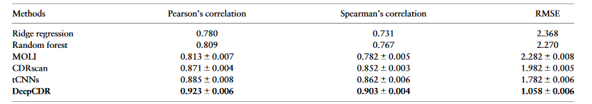

# Introduction

The goal of this pipeline is to implement a Cancer Drug Response Prediction pipeline. The model chosen is called DeepCDR which is a Cancer Drug Response Prediction model via a Hybrid Graph Convolutional Network. This model was published in the journal Bioinformatics. DeepCDR takes a pair of drug and cancer cell profiles as inputs and predicts the drug sensitivity (IC50) (regression). The drug will be represented as a graph based on the chemical structure before transformed into a high-level latent representation by the UGCN. Omics featured learned by subnetworks will be concatenated to the drug feature.

[DeepCDR paper](https://www.biorxiv.org/content/10.1101/2020.07.08.192930v1)

[DeepCDR implementation](https://github.com/kimmo1019/DeepCDR)

# Data Model

This pipeline can be adapted to every graph with 2 types of nodes :

- Cell lines: Cell lines features need also to be accessible in the graph.
- Drugs: Only the SMILES representation of the drug is needed.

# Graph creation

You can recreate the DeepCDR graph or import your own data from csv files. The following are the requirements for each csv file:  

## Nodes

| Node type      | Requirements | InputConfig field |
| :---           |    :----    |          ---:     |
| Drug           | id           | drugs_path        |
| GDSC           | id           | gdsc_path        |
| CELL_LINE      | id, tcga_code| cell_lines_path   |
| GENE           | id           | genes_path        |

## Edges

| Eedge type     | Requirements | InputConfig field |
| :---           |    :----    |          ---:     |
| HAS_CELL_LINE  | START_ID, END_ID, label          | gdsc_cell_line_path        |
| FOR_DRUG       | START_ID, END_ID                 | gdsc_drug_path        |
| HAS_EXPRESSION_OBSERVATION      | START_ID, END_ID, observation | cell_line_gene_expression_path   |
| HAS_METHYLATION_OBSERVATION     | START_ID, END_ID, observation            | cell_line_gene_methylation_path        |
| HAS_MUTATION_OBSERVATION        | START_ID, END_ID, observation            | cell_line_gene_mutation_path        |

# Graph Neural Network based AI Model

We define a `DeepCDR` model for Cancer Drug Response Prediction predictions. The model consists of 3 modules. The first module is a graph level GNN and operates on the drug features to generate a learned embedding vector of dimension 100. The second module operates on the cell lines features to generate learned embedding vector of dimension 300. The final MLP/CNN modules operates on both of these learned embeddings and generates the interaction value between the drug and the cell line.

# Results

We trained the model from scratch and reproduce the same metrics as in the paper for 3 different metrics :

- Pearson correlation: 0.923 +- 0.006
- Spearman correlation: 0.903 +- 0.004
- RMSE: 1.058 +- 0.006

# References

# FAQs

    
 How can I run this recipe on my own data? 

    
 In the current recipe, there are three types of features for each
    cellline: genomics, epigenomics, and transcriptomics. What if I have only one or two of them?
    

    
 Can I add additional features beyond genomics, epigenomics, and transcriptomics data for celllines?

    
 What kind of Graph Neural Network (GNN) model are you using in this recipe? Can I use any other GNN models? Can I use my own custom GNN model? 

    
 Can I replace the entire DeepCDR model with my own custom model? 

    
 How can I train the DeepCDR model with a new set of hyperparameters? 

