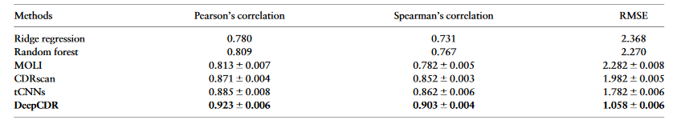

# Introduction

The goal of this pipeline is to implement a Cancer Drug Response Prediction pipeline. The model chosen is called DeepCDR which is a Cancer Drug Response Prediction model via a Hybrid Graph Convolutional Network. This model was published in the journal Bioinformatics. DeepCDR takes a pair of drug and cancer cell profiles as inputs and predicts the drug sensitivity (IC50) (regression). The drug will be represented as a graph based on the chemical structure before transformed into a high-level latent representation by the UGCN. Omics featured learned by subnetworks will be concatenated to the drug feature.

# Graph

This pipeline can be adapted to every graph with 2 types of nodes :

- Cell lines: Cell lines features need also to be accessible in the graph.
- Drugs: Only the SMILES representation of the drug is needed.

# Model

We define a `DeepCDR` model for Cancer Drug Response Prediction predictions. The model consists of 3 modules. The first module is a graph level GNN and operates on the drug features to generate a learned embedding vector of dimension 100. The second module operates on the cell lines features to generate learned embedding vector of dimension 300. The final MLP/CNN modules operates on both of these learned embeddings and generates the interaction value between the drug and the cell line.

# Results

We trained the model from scratch and reproduce the same metrics as in the paper for 3 different metrics :

- Person correlation: 0.923 +- 0.006
- Spearman correlation: 0.903 +- 0.004
- RMSE: 1.058 +- 0.006

