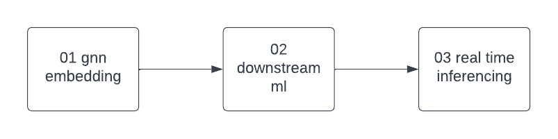
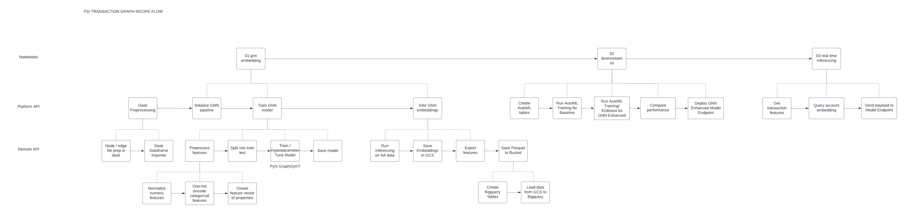
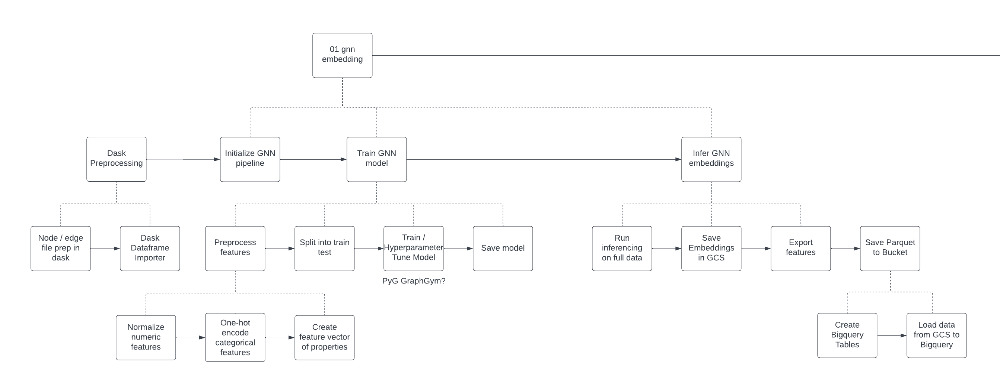
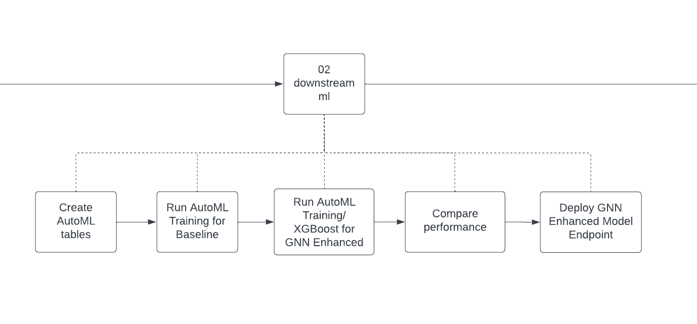
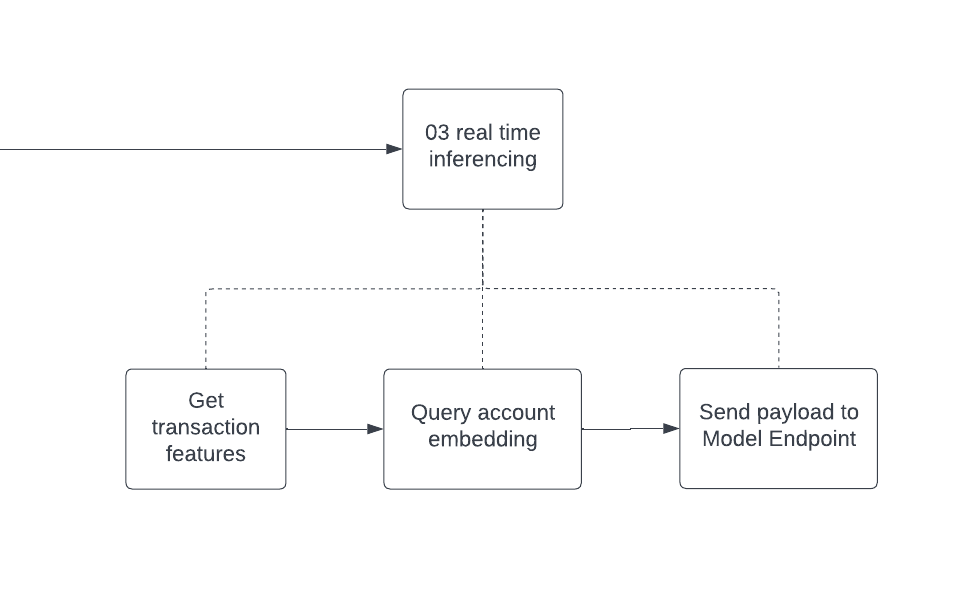

# FSI Transaction Graph Recipe - Elliptic Fraud Detection Demo

Demonstrates the Transaction Graph Recipe flow using fraud detection as the use case. 

***Dataset:*** Elliptic Bitcoin Transaction Dataset

---
### Pipeline Flow

The Transaction Graph Recipe Demo is an end-to-end demo of the example pipeline. It is divided into three sequential notebooks:



Each of the notebooks can be decomposed into the following layers: 

1. Platform API (High-level Notebooks) - proposed API for enabling users to access high-level functions to easily complete an end-to-end pipeline.
2. Remote API - existing Katana APIs

The diagram below shows the end-to-end flow with the decomposition into platform and remote API layers.  



[Full Diagram Lucid Chart Link](https://lucid.app/lucidchart/ff85ed86-8cdc-44d9-9185-5678065009f6/edit?viewport_loc=-603%2C-889%2C5184%2C2855%2COF631DYT-awb&invitationId=inv_11452d1d-4e20-4c9f-a823-15531721127b)

---
#### 01_elliptic_gnn

Trains the GNN model and generates the embeddings for downstream ML pipelines. 



##### Best Practices for Generating Dask Dataframe

One of the key parts of the 01 notebook is the generation of the Katana RDG using Dask. We have outlined some best practices when using Dask dataframe importer. 

- For transaction graphs, first try homogeneous representations before going to hetergeneous. Many time, the most simple graph with good relationships will generate the best embeddings. The more complex the graph and connnections, the more difficult it might be for the model to be generalized (e.g. higher risk for overfitting). We recommend using dask to create the homogeneous graph before importing into Katana Graph.

#### 02_downstream_ml_training

Once the GNN embeddings have been exported, the downstream models can be trained using GCP Vertex AI AutoML. We break this section into two notebooks, A and B, so that the baseline and GNN enhanced models can be executed in parallel. 

#### Running Auto ML models

 To run the Auto ML models, run the following commands: 
 ```bash
 pip install google-cloud-aiplatform
 ```



Note that the user will need to go to the GCP Vertex AI console to deploy the endpoint for the real-time inference notebook below. 

#### 03_real_time_inference

Once the endpoint has been deployed, the last notebook demonstrates a real-time inference example. 

